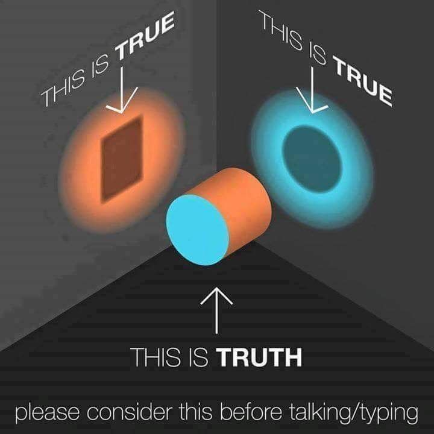
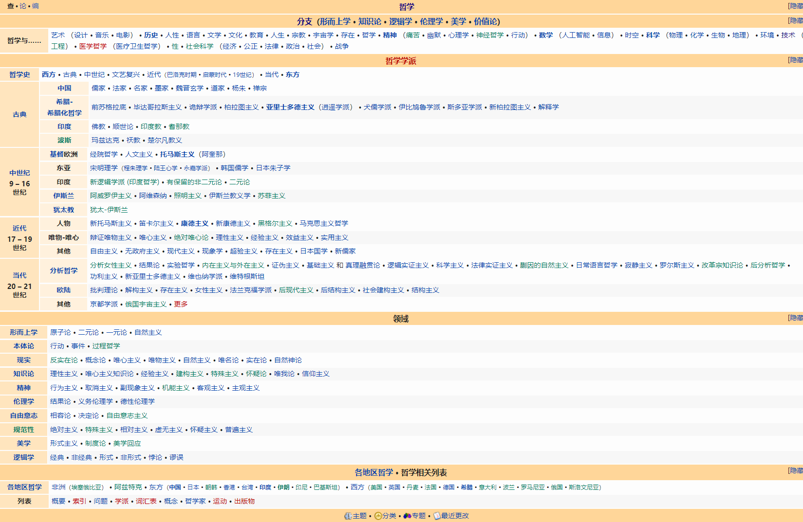
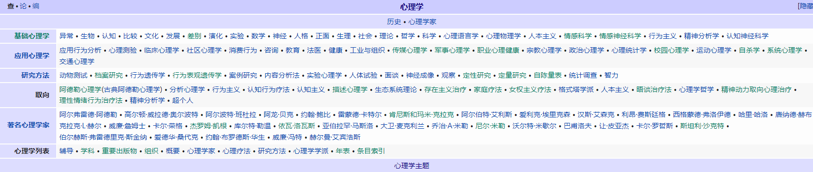
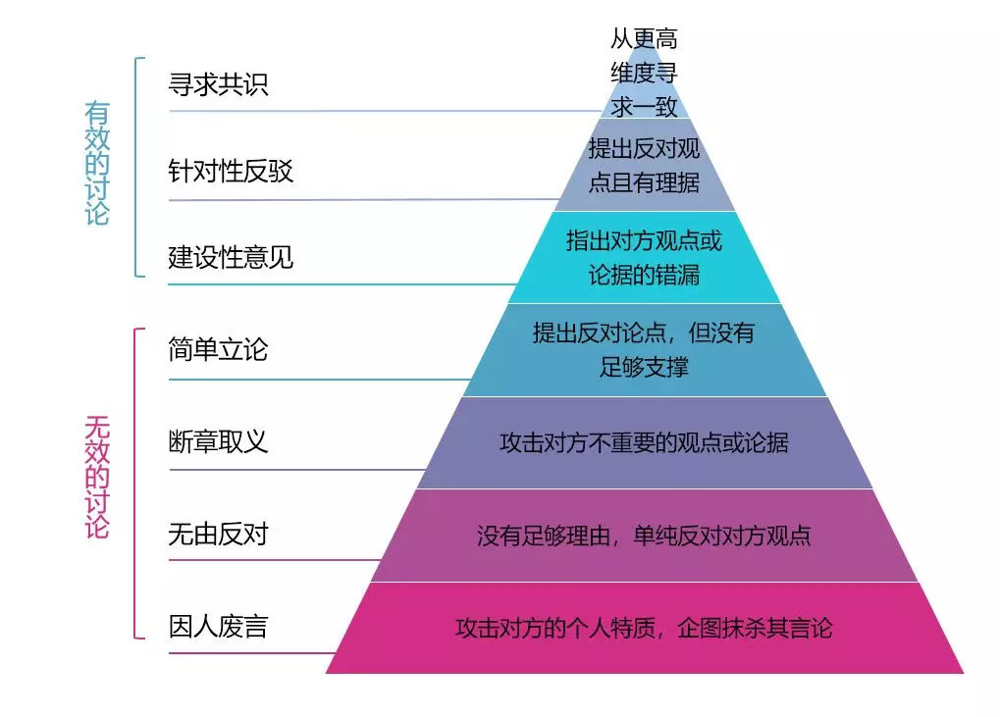

# 概述

本文档并不是读书笔记，而是在学习/生活的过程中，归纳总结一些切身实用的经验与道理，借由一些感兴趣的话题表达出来，方便自己形成一个相对系统的世界观。另外，在国内公开写人文相关话题的文字是非常困难的事，动不动就敏感了，经常想到一个好的现实例子，但不敢写出来，看到一篇文章讲得真透彻，但不能发，自己写点文字，话也得绕着说，写得确实不那么痛快。本文算是戴着镣铐跳舞吧。

## 根本指导方法

1. 学而不思则罔，思而不学则殆

2. 切记陷入虚伪与空洞的绝对理性（尤其是自欺欺人的诡辩），或是缺乏自我意识的绝对感性。仰望星空的同时，脚踏实地

3. 站在更高层次/抽象的方式看问题，用多视角看问题，以对下层的矛盾逻辑进行统一（见下图）。特别适用于当多方矛盾的观点听起来都很正确，特别适用于伦理问题、审美问题，诱导性提问（只能回答“是”或“否”）。

4. 目前等级还比较低，允许简单窥探，但不深入研究比较“危险”的话题，以避免陷入癫狂状态。话题如：为什么我们人类毁灭会事件”坏事“，有没有可能是”好事“；为什么自杀不是件好事

5. 克制冲动，不要把该文写成读书笔记与知识体系！！！如：XX是什么、特点、意义作用、历史、类型流派，分支是XX。要刻意把本文写得“散”+“杂”

6. 多点“人文关怀”技能树：《十三邀｜第六季 ：许知远对话黄灯 我和我的二本学生》

7. 慎言。借用杨绛的“你的问题主要是读书不多，而想得太多”，每当试图回答哲学问题时，自己也应该想到“你的问题主要是读书不多，而回答得太多”。

   如“应不应该阻止自杀”这一经典回答，面对这类问题时，首先不是去试图回答这问题，而是借由这问题，先去发现自己的无知，对自己的知识体系进行查漏补缺。一些人上来就试图凭借自己“想当然”想法作答，但从古自今人们选择自杀原因无数，古今中外的社会境遇也完全不同，如果只是通过简单结合自身短暂的生活经验，用一句简单的“应该”或“不应该”回答，那就显得太随意了，很容易陷入纯粹的“口嗨”，对自己的知识增长也没什么帮助。

   对于这类问题，至少要做大量的跨学科阅读，如阅读哲学/社会学/心理学/历史等等相关资料，了解了这类话题的知识体系，等心里大概有数了，再试着回答。

8. 避免成为二极管。当局者迷，旁观者清，要常常自省自己有没有走极端。如追求理性，还是感性；浪人与粉红；有意义与无意义；读书无用论与“唯有读书高”；有被讨厌的勇气与完全放飞自我；盲目追求成为独立女性（去人性化，不敢面对自己的内在需求和情绪）与完全依赖他人。

9. 人最有成长性的能力就是：认识并承认自己的无知

补充：

主要关注的话题：主要是个人话题、而非群体话题。

# 参考问题

WIKI把每个话题都进行了很仔细地分门别类，要有事没事去看看。

# 个人

## 人生意义、为什么要活着（人为什么不去死）

（该话题其实是很多看起来“毫无关系”话题的根本回答。如在指导方法所说“站在更高层次/抽象的方式看问题，以对下层的矛盾逻辑进行统一”，关于人生意义的自我回答是一种可以给很多话题进行“最终”统一的回答，因此先放在首位，以时刻铭记）

我在第一阶段认为：人生意义到底追求真善美，只是不同的人对“如何追求真善美”有着不同看法。有些人诉诸于宗教，有些人诉诸于艺术，有些人诉诸于劳动与奉献等等。之所以人们的追求不同，不外乎各自的条件不同，比如一些人出生在宗教社会，那自然地信宗教比不信宗教的阻力小（这里的“信”指的是发自内心地信），但你让另一些出生在无神论社会的人信宗教，那阻力就大得多了，尤其人地三观成型后，很难“发自内心地信”，强行将人生的意义寄托在宗教上，对这些人而言不“现实”；又比如说我们听到“童年音乐”，我们听到这些音乐和很多后背听到这些音乐的感受完全不同，这种与“童年”绑定的音乐已经能超越一般的美感与理性，给自己一种独特的愉悦感。

我在第二阶段想：当我们在问“人生的意义是什么”，借用象征符号试图描述我们的问题时，我们实际思考的问题是什么？这个问题是否是个诱导性提问？换句话说，有没有可能这问题本身就不成立，其实无论“有”还是“无”的回答，这些的回答都是空洞、无济于事的？

人类的一切活动最终会随时宇宙而灰飞烟灭，除了信仰宗教的人可以借助“神”作为最终解释来回答一切意义问题，我们所谓的各种意义总将灰飞烟灭，诸如人必死，功名利禄与快乐幸福皆成虚空，那为什么人不趁早去死？第一阶段提到的各种方案是不是对另一个我们内心潜在问题的回答（而不是对表层“人生的意义是什么”的回答），所以我们其实是在回答什么问题？这个问题是否类似：**我们是否可以找到一种能够“说服”我们的信念，让我们真心相信的信念，并通过这个信念尽可能减轻自己的痛苦（题外延申问题：为什么人也可以通过“痛苦的体验”来感受“愉悦”？）、增加自己的快乐。并且这个信念最好能持续一生，而不是年轻的时候信一套，年纪大了之后信另一套与之前矛盾的信念”（PS：认为自己什么都不信也是种信念）**

（这个问题转换的巧妙之处，它把”人生意义是什么“，这一”人生意义这一**目的**是什么“的问题，转换成了”作为**手段**的人生意义是为了什么目的“的问题。这也是为什么我认为“无知”不总是件坏事。如果一个人被别人压榨了一辈子，终日活在回声室里，尽管一部分人把他当愚昧之人看待，但他却发自内心地认为自己所做之事“有价值”与“有意义”，那只要他一辈子遇不到“麻烦”，并且一辈子也不公开质疑，那可能倒也能够觉得活得“值了”）

继续延申，我们是否可以借助我们从美学教育中得到的经验“如果你发自内心觉得一个艺术品不美，就算别人告诉你这个艺术品是如何地鬼斧神工，背后蕴藏着多么身后的文化底蕴。我们可能只会附和或自欺欺人地说句“哇，那真不错呀”，但扪心自问，确实还是没感觉到什么美感”：**美的感受不应该是通过理性分析出来的**。尤其是当我们听到一些“爷青回”的歌曲或影视，我们那种愉悦感也是超越一般理性的。

借此我们发现人生所谓的意义可能不是追求“目的”或感受“过程”，而是**忘却时间这一维度的感受当下**。感谢我们的理性将我们带到了这里。接下来，为了避免陷入一种空洞且虚伪的形而上纯理性分析，我们应该学习像猫猫狗狗那样，借由“感性”来感受生活，如“去码头搞点薯条”。

---

而这样的感受，往大的说可以是发现与感受“真善美”，往小的说可以是我们提到的“幸福七要素”（健康、安全、尊重、个性、与大自然和谐相处、亲密关系、闲暇）。因为“真善美”与“幸福七要素”，如同快乐的感受一样，本身就具备内在价值，我们不会把快乐当作“手段”，而是当作“目的”。当我们看到美景，我们会发自内心的赞叹，感叹大自然的鬼斧神工，而不是经过理性分析而感。而如何培养感受力就需要借助一些“手段”：第一阶段提及的诸如艺术（艺术很有利用触发人的自省，归纳自己的潜意识行为）、宗教（我们不把信宗教当目的，但可以把它当“手段”来培养智慧）

另外，我们也不应该过于强调文化差异而导致人对幸福理解的不同。我想，如同我们一直反复提及的幸福七要素。这些要素具有普遍性与稳定性，我们只会羡慕一个人健康的身体，而不会羡慕一幅死气沉沉、疼痛缠身的皮囊。我们会羡慕一个人良多知己，而不会羡慕一个人孤独终老。注意：这些我们“不羡慕”的人也可以活得开心、幸福，只是这些独立的要素并不值得让人羡慕。如果有一个人赞美苦难，那他要么是蠢，陷入了自欺欺人的虚伪境地（需要哲学+心理学的救赎）；要么是把“苦难”当作了一种追求更大“真善美”的一种手段；要么是坏，通过对他人洗脑，将他人作为工具以谋求自身利益

提醒：尝试学习如何再次进入超然状态。偶尔能感受到一个超越死亡的轻松自在（即：一般时候，我们思考死亡是“细思极恐”，但有时通过上面人生意义问题的追问，反而能进入一种超然状态。TODO：这是实际什么状态？是否需要借助一些灵性体验？）

## 哲学的“作用”

导读：[哲学的初心与哲人的使命——给日新书院大一新生的一堂哲学导引课](https://www.phil.tsinghua.edu.cn/info/1037/1930.htm)

哲学应该是人必学的一门学科，很难想想一个人如果不学哲学，那会少了多少乐趣。很多人以为哲学就是研究“世界的本质是什么？”、“世界上有鬼吗？有神吗？”这种形而上（本体论）问题，被这些问题给“无聊”住了。

但哲学有很多“实用”功能，并且也可以研究很多“现实”问题诸如：

1. （美学）比如一些大佬觉得抖音的歌曲很低俗，用户的审美趣味很低。那问题来了，你的审美标准是什么？为什么你觉得你的标准就比他们高级？小众的、抽象的就高级？如果那么多用户都觉得这些东西有趣，你更是凭何说他们低级？就因为你受过高等教育？那别人听古典乐的就可以认为我们这些不听古典乐的人是低级的了？但如果我们玩乐器学乐理但不听古典乐，那些不玩乐器、不学乐理但听古典乐的人，又有什么资格说我们低级？我们在聊审美标准的时候，是不是在对话语权的一种争夺，是不是一种傲慢与偏见？我们在聊评判审美的时候，实际在评判什么？（问题的问题=>元问题；符号学问题）

2. （虚无主义问题 + 潜意识问题）很多人祖祖辈辈几辈子奋斗下来的终点，都达不到一些上层阶级的起点，尤其是你身边真认识过，XX代。这些大佬出生就自带别墅、家佣、专机、司机、权力、一群人的巴结、各种绿卡以及各种想象不到的事物。那问题来了，那你奋斗当人上人的意义是什么？（虚无主义问题）所谓的人上人可能也是同圈层内的互卷，按照世俗角度看，上层看下层就跟看笑话一样。

   另外，这也牵涉出另一个问题，即很多人的潜意识里认为奋斗就是为了当人上人，但表意识可能自己把自己“骗”住了，口上说我奋斗只是为了让自己与家人过上更好的生活，导致“知行不合一”，而要认识到自己的不自洽，就又需要学习哲学/心理学，并坚持自省。一些人觉得别人不就是有钱有权嘛，没啥了不起，但为什么这些人在面对这些XX代时，还会心虚？为什么心虚？甚至心态上就已经有“低人N等”的感觉了？不是自己都提倡“人人平等”吗？难道还是“自我以上人人平等，自我以下阶级分明”？

3. 学会怀疑，避免被人单向利用，即“被割韭菜”。这种被当成“手段”，而非“目的”的例子在现实生活中太多。口中讲着仁义道德，让你信奉，心里想的却是“你死不死关我屁事”，背地里疯狂“吃人”，跟这些人聊人权问题，就是在讲笑话。而要认识到自己被人利用，或尽量避免被人利用，做到“身是菩提树，心如明镜台。时时勤拂拭，勿使惹尘埃”，那就要学哲学/心理学，意识到别人是在强加你他们的意志与世俗欲望，以试图让你信奉了它那套价值体系，如最典型的消费主义。

   另外，也延申出另一个问题：你想过的生活，是真得你想过的生活，还是别人告诉你的生活？在一些时候，我们欣赏一些事物或做一些事物，单纯觉得这些事物有趣好玩，于是就会有人告诉你“啊，你傻吗？你为什么不搞钱”；然后我们第一反应就会诧异“啊，为什么要搞钱？我搞钱是为了给你看吗？啊？你哪位？”

   于是一个新问题也来了，世俗欲望与自我意识如何平衡？哪些欲望是真的，哪些欲望是假的？我表意识这么认为，但我确认我的潜意识也这么认为吗？

   > 我们每个人一出生，就像是坐在一直运动的马车上，自己也是动着的。
   >
   > 然而，有的人睡着了，有的人醒着。
   >
   > 睡着的人，马车把他拉到哪里就是哪里，他不思考，不选择或者找各种理由说自己没有办法选择。这样的人生不是自己的人生，而是马的一生。
   >
   > 醒着的人，更愿意自己驾驭马车，进行自己人生的选择，不论是走大道还是小路，都是自己选择出来的，都是自己的一生。
   >
   > ——基尔凯戈尔。PS：上述并非完全原文

4. 最近很“流行”养宠物，并且近期也有针对疫情而杀狗的事件发生。那问题来了，为什么一些人杀狗完全没感觉？为什么一些人看到狗被杀就已经非常震惊，尤其还是那么可爱、萌萌的狗？可那些同情狗的人不也天天吃其他动物吗？就算他们是素食主义者，那他们咋不去同情下植物呢？他们是不是“双标、虚伪”了？

5. 以及上面提出问题时，用到的逻辑（逻辑学）

除了上述比较世俗的问题外，还有诸如提升艺术鉴赏力（美学，哲学的分支学科）：真正的艺术作品是在有限的形象中，展开无限宽广的领域。超越逻辑，培养性灵（创新的源泉）。我们总得在我们的业余生活中留出一些时间，交给艺术，以便保存和滋养我们的直觉、想象和感悟的能力。我们看 [广西财经学院齐舞作品《殙》](https://www.bilibili.com/video/BV1KK4y177FL/?spm_id_from=333.788.recommend_more_video.-1)，就会感受到一种毛骨悚然、头皮发麻的震撼（言语无法表达，请看视频），就会感受到冥婚是这样的一个封建糟粕，我们要尊重人权，避免重蹈覆辙。我们听日本的city pop（如中森名菜的《oh no, oh yes》），我们虽然不曾在那个时代带过，但当我们听这些歌的时候，就宛如超越了时空，宛如看到了日本当时泡沫经济下那“糜烂”的夜生活，宛如在跟他们一同歌唱起舞。听森田童子的歌（如《地平线》），这些歌又让我们“看见”了当时日本学生运动下，年轻人的迷茫，“原来日本还有这么一个年代呀”。艺术让我们超越时空限制，感受美（提醒：也有悲剧美），并再次反思当下的生活。

综上，只要活着，我们必然需要做各种感受、各种判断。大部分中国人信奉的是“机会主义”，用陈丹青的话说“活下去最要紧，这是很伟大的信仰。什么东西有用咱们就用，没用就打倒它，如果翻翻历史发现有用，又会再拿出来，中国人不讲原则，不像欧洲人按照一个哲学系统、思想系统来处理国家的事和私人的事”。而要活得智慧、自洽、自在、知行合一，且经过“自我审视”，那就需要学哲学。

当然这其中又涉及到另个话题即“无知的快乐”：为什么我们要活得逻辑自洽，为什么我们要排斥无知，如果有人就愿意保持无知且快乐不好吗？

## 宗教、科学、艺术、哲学

## 幸福

## 疾病与死亡

[80后大叔确诊肝癌晚期，记录自己最后的时刻](https://www.bilibili.com/video/BV1Ea411i7rt?spm_id_from=444.41.0.0)

### 自杀

## 无知的乐趣

## 美学与精神世界

### 人可以没有精神世界吗？

## 自我意识与单向度社会

## 无聊

### 掌握无聊

## 欲望、犬儒、躺平

夫唯不争，天下莫能与之争 

### 低欲

### 名利

## 嫉妒与妒忌

嫉妒：关系上的嫉妒、成就上的嫉妒

条件：客观上对方拥有，我欠缺；主观上我也觉得我欠缺

嫉妒背后的理性：

嫉妒背后的不理性：

## 傲慢与偏见

### “精英”的傲慢

## 冷漠与关注

### “关你屁事，关我屁事”

## 孤独

## 面对不公、虚伪或荒诞的事（如空洞的宏大叙事）

“卑鄙是卑鄙者的通行证，高尚是高尚者的墓志铭”

犬儒？

## 理性的癫狂

TODO

## 人格

识人：

* （设假设）交友时主要看重：

  * 品行：诚信（所有优秀品质的根基）、情绪的稳定性、尊重、善良、同理心。反例：撒谎、跪舔、PUA等。
    特别注意：具备其他优秀品质，但不具备良好品行的人容易发展成“精致的利己主义者”，如割韭菜行为。

    特别加分项：真挚、热忱

  * 综合心智水平（参考拉文格自我发展阶段）。交普通朋友：至少处于公正阶段；交男女朋友：至少处于自主阶段

  * 知识水平

  方法：

  * 观察对方有没有能力进行有效沟通（参考“反驳金字塔”）
  * 故意与对方聊与其意见相左的问题
  * 观察对方遇到自己不懂问题时，会如何处理（即：是否有能力+勇气承认自己的无知）

* （求证假设）观察对方有没有人格障碍倾向。这点也非常关键，因为现实情况下，人永远是错综复杂的。

  比如表演型等人格擅长伪装与欺骗、投其所好，凹人设，比如说自己也有类似爱好（但其实没有）、或用力夸赞（而非真诚夸赞）等，表现出咱们是一类人。如果无法察觉到这点，就会误以为对方是善良或具有同理心的人。又比如回避型依赖人格擅长冷战、边缘性人格常见情绪不稳定等等

### 人设与表演

### MBTI

（2022年4月）

https://www.16personalities.com/profiles/6665cf32f10ab

Personality type: Logician (INTP-A)
Traits: Introverted – 83%, Intuitive – 65%, Thinking – 66%, Prospecting – 63%, Assertive – 60%
Role: Analyst
Strategy: Confident Individualism

### 黑暗三角人格

### PUA之恶

PUA 是害人的歪门邪道。不想入邪门，或者自认为有能力 Hold 其中的恶再考虑要不要学。我如果对一位刚认识的人感兴趣时，我就会非常“害怕”别人使用一些低劣但自我感觉良好的 PUA 套路（如欲擒故纵、废物测试等），但别人可能心理把你的套路看得明明白白了，只是别人不说破，但心底已经对你已经感觉到了失望与惋惜，因为使用 PUA 通常有这么几种情况：

1. 做人不真诚 /善良（这可是亲密关系中的一大致命缺点，因为爱的前提是尊重）。通过PUA把人当工具，妄图控制别人，不懂得尊重人
2. 缺乏非暴力沟通的能力
3. 自己的各项能力缺乏自信，需要低劣的 PUA 手段弥补
4. 心智不成熟，有黑暗三角人格的潜质（自恋+马基雅维利主义+心理病态）

现实案例：PUA控制欲 => 百万粉丝网红Gabby Petito诡异命案+韩国溪谷离奇死亡事件

# 社会与群体

## 集体无意识

### 塑造集体记忆+想象共同体

## 判断

### 审美有无高低

审美的背后是话语人客观与主观上权力的高低

### 伦理判断

### 价值判断

#### 诡辩（智者学派）

#### 社会评价

#### 自我评价

## 认同

### 凝视

### 文化认同

### 自我认同

## 话语权

### “高情商”

### 神化、污名化、祛魅（结合资本与消费主义）

去人化

#### 同性恋是否道德？

#### 道德基准由谁来定？

##### 耻辱感的淡化与重塑

###### 为什么女性袒胸露乳的行为会被认为是伤风败俗？其伦理学依据是什么？

（性伦理——公共礼仪；两性——性别规范）

### 操控、去人化、物化

#### 选美

### 话语体系与思维模式框架

社会加速与技术中心主义批判

### 中国网络环境下他者的消失与肯定性的暴力

## 沟通的本质

## 人文关怀

## 人权

这话题注定是展不开了的，这里只是做个分类，以让我时刻铭记一些事迹。

## 女权

我学女性主义的原因：

* 了解一个群体是如何通过各种手段歧视与控制另一个群体的，如常见的愚民（如早期剥夺女性受教育的权利）、神话与污名化手段。这不仅包括男性与女性之间的关系，也包括诸如资本家与打工人、政府与百姓等关系。

  以“神话”为例，在母性神话中，它将母爱捧上神坛，将女性的奉献视为理所当然，以此给女性设立道德标准，若有女性无法满足或不服从，便对其进行道德贬低。同时减轻了既得利益者的负罪感，发展出诸如“白人的负担”与“大东亚共荣圈”，让其自认为是好人，并在帮助那些“弱势群体”。

  以“污名化”为例，女性主义要求女性能够主宰她们自己，而不是要主宰男性。但一些男性遇到这类言论时，会故伎重演地将其扭曲成“女性试图主宰男性”，让女性主义遭受反冲。

* 更能发自心底地尊重并平等对待女性。比如尽可能避免无意识的厌女症（女性蔑视）与“善意的性别歧视”，如“我是男人，我来养你/我买单”。这类行为的结果表面上有利于女性，但它满足了人们的刻板印象，将女性置于弱者的地位。

* 意识到女性内部其实也存在分化。如婆媳关系中，婆婆有媳妇可以剥削了，因此成为了父权体制下得帮凶。

* 意识到男性歧视女性也是有代价的，男性也是男权社会的受害者。男性害怕自己不够有钱、不够有社会地位、找不到女性伴侣、表露情绪（显得带有“柔弱的女性气质”）等，而偏离男性团体的“规格”，并被评判为“不够男人”。

* 锻炼从更高层次看问题的能力，避免陷入浅层的女性批斗男性层次。

* 借女性主义话题，判断聊天对方的：心智发展水平与知识水平。

* 在日常生活中，识别新老剧本与双标。如一方面强调女性独立，一方面约会一味要求男性付钱；某女方的工资远低于男性的工资，却嫌弃男方很穷。

* 等等

我认为女权主义者是：认同女性是独立的个体，并对女性予以尊重的男性或女性。特别一提，个人看女性主义的资料并没有想给自己贴“女权主义者”的标签，以避免要维护不必要的人设，并进行不必要的表演（具体内容见“人设与表演”章）。

### 恐男

https://www.bilibili.com/video/BV1eY41177hd?spm_id_from=333.851.b_7265636f6d6d656e64.1

## “打脸文化”

## 内卷

[从哲学角度看：我们对教育「内卷」的认同是如何形成的？](http://www.scieok.cn/post/1666.html)

## 人格、教育与规训

## 中国巨婴

## 动物权利

## 色情

## 探讨不能实现的话题的意义是什么？（如动物权利）

距离

戾气

## 煽动

常见：政治宣传、吸引流量（男女对立）

https://zh.m.wikipedia.org/zh-hans/%E7%85%BD%E5%8B%95

## 开源

### 开源项目作者的态度重要吗？

申明：由于现在“开源项目”一词普遍用法更偏向于其广义上的定义，即几乎只要是公开源码 /文档的项目，人们就自称或称其为“开源项目”，但其实“公开源码的项目”离严格定义上的开源项目还相差甚远，其具体定义读者可以阅读[The Open Source Definition](https://opensource.org/osd)。**本文在不特指的情况下，沿用如今普遍使用且广义上的“公开源码 /文档的项目”的定义**

前段时间在读梁光耀的《图解实用伦理学》，这书通俗易懂，举的例子也非常有趣且接地气，唯独深度上差了些意思，可能就是为了照顾我这样的小白吧。而开源圈总是有“开源态度”相关的话题，这类话题真算是经久不衰了，每年都有人开新话题进行讨论，但感觉无数人的讨论在深度上都差了点，让人看得也不够过瘾，于是想试着从伦理学角度并结合长期在开源圈的观察来简单聊聊这话题。

评价开源作者的“道德问题”，或者说是“开源项目作者的态度重要吗？”，感觉有两个因素非常关键：一是从康德伦理学角度来看，就看看开源作者的态度，动机是好的，那就无可非议，动机不行的，那就算“不道德”，这类评价方式好像很像是自由软件强调人权的评价方式？；二是从功利主义来看，看看开源作品的价值，不谈动机，只谈结果。我通过这两个角度，把各开源项目分为了 6 类：

- 作者有态度，且项目有价值
- 作者有态度，但项目没价值
- 作者是无所谓的态度，且项目有价值
- 作者是无所谓的态度，且项目没价值
- 作者态度恶劣，但项目有价值
- 作者态度恶劣，且项目没价值

当然，一位作者是否有态度，项目是否有价值，有时候并不是那么绝对的，大家评判不一，甚至还能同时存在“即有态度，又没态度”的矛盾状态，态度也能随着时间不断变化，我感觉也正是因为这些模棱两可的状态，让网上吵个半天也聊地不够透彻。这里先简单谈下什么是“有态度、无所谓的态度、态度恶劣”、“有 /没价值”：

- “有态度”主要指开源作者有责任心、有真奉献精神、做事踏踏实实，主动性强。补充：大部分开源 License 都不要求开源作者负有任何义务。

- “无所谓的态度”主要指开源作者通常就是抱着玩的心态，也没指望什么人严肃地来用，就日常做做，比如简单的练手项目，它即不像“有态度”那样偏于积极的态度，但也不像“态度恶劣”那样偏于负面的态度，反正就是随便做做，无所谓的态度。

- “态度恶劣”主要指作者急功近利，开源的首要目的就为了搞 KPI 、推广公众号或面试加分，通常目的完成就跑路。当然还有更恶劣的，就是开源项目带有欺骗性质，比如结派互刷 Stars 、抄袭套皮，初期看似诚意慢慢，后期展露本心，开始无下限地进行收割。更有甚者不以为耻，反以为荣（笑贫不笑娼）。

- “有价值”主要指开源项目或文章的原创内容比较稀缺，比如开源的基于双数组 Trie 的 AC 自动机算法实现，又或者[voicevox](https://github.com/VOICEVOX/voicevox)、[audiveris](https://github.com/Audiveris/audiveris)（ PS：非推广，本人和这些项目没有任何利害关系）。另外一提，一些大佬看不上很多开源项目，感觉 Nginx 或 Redis 的源码也不过如此。但这就是稀缺度的问题，每位大佬都感觉自己也能写，但愿意腾出自己那么多时间、持之以恒，并能写出名的，可真就寥寥无几了。

- “没价值”主要指某个开源项目或文章千篇一律、烂大街。特别一提，没什么技术含量的项目也可以有高价值，关键还看稀缺度。

  **特别注意：这里指的稀缺度，指的是原创内容的稀缺度。**

  之所以要特别强调是原创内容的稀缺度是因为还有一种观点认为是“世界上不存在没价值的项目，只有没放对位置的项目”，诸如一个在 GitHub 上被人抄了几万次的面经文档项目被培训班用于给完全不懂编程 /还没入行的人做培训，那客观来说该文档确实变得有价值了，但如果按这观点来看，那啥项目都可以被认为是“有价值的”，但如果真把具有稀缺原创性的项目和那些抄袭集大成的项目归为一类，认为“都有价值”，那我们也会觉得这样的价值分类太笼统且随意了，怎么可以把抄袭的项目和原创项目的价值混为一谈呢？

  正是由于价值的标准可以如此多样，为了避免有关价值判断的讨论无休无止，本文谈的“价值”主要是基于其原创性内容的稀缺度来判断的。

  另外，从项目的 Stars 或付费用户数来评判也是不准确的，诸如像[Maven](https://github.com/apache/maven)这样被无数人使用过的项目一共也才 3K stars ，尤其越底层的项目通常越是如此，尤其是捐钱的人通常更愿意给它们使用的上层应用捐钱，而不给其底层项目捐钱。

先从简单的“态度恶劣且没价值”入手吧。我初想“态度恶劣没价值”的东西怎么会有人关注呢？但转念一想，GitHub 的中文榜单很多时候还真就这样（我最近没关注了，我是被恶心坏了，整出 PTSD 了），都是一堆被无数人做了无数次的电商 /博客项目，被人抄了无数次的面试题，很多作者是开个源，维护几周，刷完面试 /公众号 /KPI 就跑路了，这些作者就像是无生气、无创造力的机器人（不知道教育在这里做了多少“贡献”），又像是一群西西弗斯，不断重复地把山下的巨石滚上山，项目 README 底下也不忘贴几个公众号进行收割...这类项目让我体会到了什么叫做 PTSD ，如今当我看到带有“电商 /博客”关键字的开源项目，人就本能地就泛起了厌恶之感。

从功利角度来说，这些项目确实推广了一些被抄了无数遍的有用或无用的知识。但从功利主义的另个角度来看：

- 这样的项目吞噬了本属于更具有原创价值开源项目的关注度，并且不少项目还采用不道德的手段（如买 Stars 、互捧臭脚互刷 Stars 、频繁买广告 /发帖刷 Stars ），刷 KPI/开公众号做广告，目的完成了就拍拍屁股闪人，导致部分具有原创价值的开源项目的作者“做啥原创内容，吃力不讨好，隔壁一个 Markdown 项目靠抄袭+疯狂推广，Stars 都比我的多 10+倍，哥们我累了，不玩了，你们自己玩吧”，同时新人看到这类项目，也发现苦心做原创内容，还不如搞点哗众取宠来 Stars 快，既简历看着“牛逼”（“管它是什么样的 Stars ，反正我项目就 Stars 多，牛逼不”），指不定还能搞手副业。最终，劣币驱逐良币。

  我们都知道互联网有一个大问题，这个大问题不是有价值的文章越来越少了，而是水文的数量在以指数式增长，导致想找有价值文章的人不知去往何处，导致我们找一篇有价值的文章的成本越来越高，很多时候犹如大海捞针，因此不得不换一个平台，或者干脆“哥们我退出，不玩了，你们自己玩吧”。开源圈同理。

- 另外也让一些人觉得“搞慢工出细活，不赚钱+原创性高的开源项目的作者都是 SB 吧，看看别人天天水文，给新人做 Hello World 项目，靠公众号做推广，现在都已经买车买房了”，认真做开源的人但不赚钱的开源项目作者反而被扣上了“老实人 /天真”甚至“愚蠢 /不懂赚钱”的污名化帽子，一些同行也在不自觉地笑贫不笑娼（或者干脆打心底就认为：我就笑贫，不笑娼，咋滴？）

- 并且这样的风气通常越越演越烈，“反正抄就行，我干嘛要原创？”，很多项目都是抄来抄去，**甚至还有欺骗 /抄袭 /套皮性质**（我个人认为“抄袭 /套皮并说是自研”是开源圈里的最无耻的行为，没有之一。如果还有，请读者帮忙补充），真是体现了马太效应，恶者愈恶，癌细胞般的存在。

  举例：《字节跳动涉代码抄袭被诉陪 22.74 亿，连错误的函数都搬》、《字节跳动回应“抄袭阿里 Ant Design 代码”：早期使用了相关文案》、《 TikTok 桌面直播应用被质疑“违规使用 OBS 等源码”》

综上，大量的无价值开源项目其实是在稀释开源圈的价值，模糊所有人的价值观，劣币驱良币。就算从功利主义角度来说，当今存在大量这样高关注度+无价值的项目也是站不住脚的。我个人也因此戏称这样的圈子为“开源娱乐圈”（ PS：这也是我个人虽然天天主动做开源，但却说自己对开源圈没什么兴趣的原因之一）。

一些开源作者会以“自由主义”来为自己正名，类似于“我开源攒了这么多关注，我自己做公众号卖广告也搞到钱了。我虽然这项目没什么原创内容，做的是电商 /博客 /...，但这关你 P 事，我怎么做是我的自由，你眼红了？”，但我的回答同上，自由是有前提的，那就是“不伤害原则”，这类开源项目的价值会以“圈子劣化”、“更多人做这类没价值的项目”、“倒逼有价值项目作者弃坑，转去搞其他来钱快的项目”等现象而作为代价，损人利己的自由是很难站得住脚的。

说完“态度恶劣且没价值”的，再聊下“无所谓的态度或有态度，但项目没价值的”，这个我感觉完全 OK ，所有人都是这么过来的，只要不要有“卧槽，我这么牛逼，你们怎么不关注”的心态就行。

还有就是“不管作者啥态度，反正项目就是有价值”。这种我感觉就算作者态度恶劣，但只要不是抄袭 /套皮 /发布的是别人家的源码，其实也还 OK ，诸如要是一老哥当初给我“你这代码写得是真的烂，你算法也太菜了，我给你写了一个为实现敏感词过滤的基于双数组 Trie 的 AC 自动机算法，你拿去用吧”，我不会吐槽这老哥，我会感激不尽，并想办法给这老哥发个红包。

综上，我个人在开源圈更认同功利主义，而非像自由软件那样强调人权、更像是奉行康德伦理学。我觉得只要是有价值的项目，作者的态度其实不太重要，就算作者是为了刷 KPI/卖广告等等，我都觉得完全 OK ，只要不过红线即可。但没价值的项目，作者的态度就重要了，态度恶劣的应该谴责，态度正向 /无所谓的就无可厚非。

TODO

（PS：写完上面一部分，发现“态度”还可以在细分一类，那就是“随意提交下代码，随意分享下，就是玩玩”的态度，回头补充下）

## 电影

寺山修司

先锋艺术

## 逻辑训练

[谬误列表](https://zh.wikipedia.org/wiki/%E8%AC%AC%E8%AA%A4%E5%88%97%E8%A1%A8)

### 反驳金字塔（Hierarchy of Disagree）

虽然这是Hierarchy of Disagree，但其实日常深度聊天也是如图的道理，因此生活中也可以参考该图，只跟在上三层的人深度聊天：

“从更高维度寻求一致”符合在开篇`根本指导方法`中的`对下层论点进行统一`，因此要追逐这种级别的谈话。

练习题：B站评论
